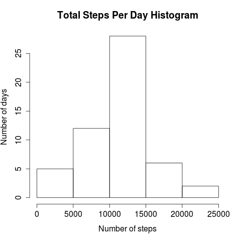

# Reproducible Research: Peer Assessment 1
Michael Fierro (biffster@gmail.com)  

## Loading and preprocessing the data
The loading and pre-processing of data is very straight-forward: the CSV file is
loaded using read.csv and dumped into a dataframe named testvals. One note: any
strings in the file that are "NA" are replaced with NAs.

```
testvals <- read.csv("activity.csv", header = TRUE, stringsAsFactors = FALSE, na.strings = "NA")
```

## What is mean total number of steps taken per day?
The number of steps taken per day can be computed from testvals tapply to walk
through testvals, using "sum" as the function to get a total per day.

```
testNumberPerDay <- tapply(testvals$steps, testvals$date, sum)
```

From this point, hist() can be used to create the required histogram below:


Using testNumberPerDay, it was a simple matter to calculate the mean (10766.19)
and median (10765) values.

## What is the average daily activity pattern?

The daily activity pattern can be seen starkly in this time series graph:


The graph shows clearly that the highest average steps are taken in the 104th
interval, which corresponds to 8:35am.
<!-- ----|---------|---------|---------|---------|---------|---------|       -->

## Imputing missing values
The dataset contained 2,304 rows with missing data. I decided to calculate the
average number of steps taken during any random interval, and use this to
fill in for all missing values. To create the adjusting value, I found the
total number of steps for all days, divided this by the total number of days in
the study (61), and then divided that result by the number of observations
recorded every day (288).

The code for this calculation is:

```
averageReplaceNAs <- (sum(testNumberPerDay, na.rm = TRUE) / 61) / 288
```

I then replaced all missing Steps values with that computed value:
```
testvals1[is.na(testvals1$steps),1] <- averageReplaceNAs
```

The altered histogram below shows that there was an increase in the number of
steps reported that fell into the 5,000 - 10,000 steps range. The highest
percentage still fell in the 10,000 - 15,000 steps range


## Are there differences in activity patterns between weekdays and weekends?
